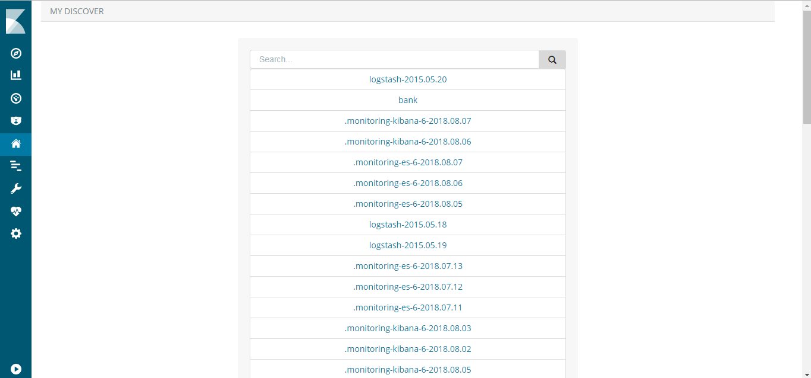
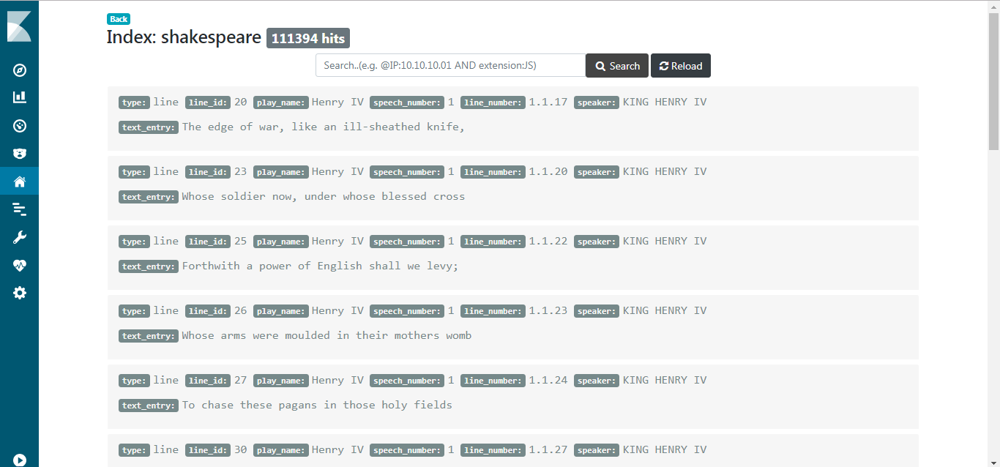
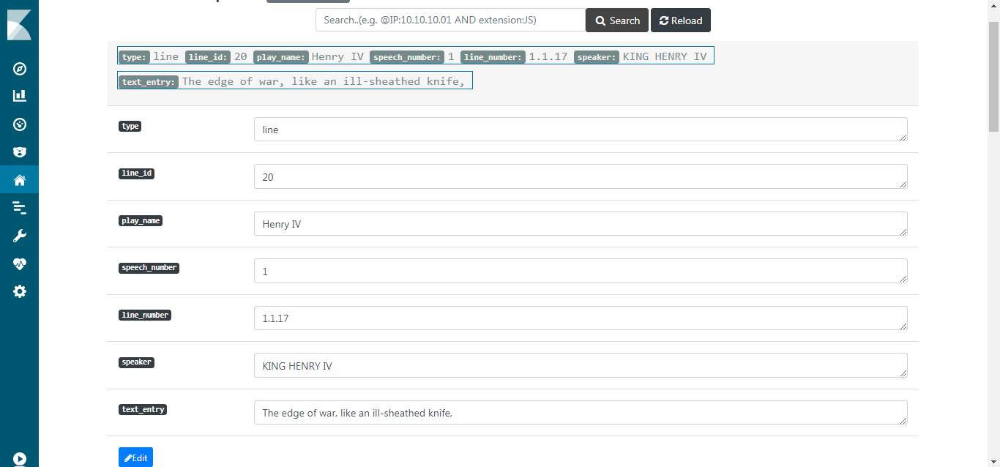

# MY_DISCOVER

> It's a copie of Discover plugin with additional feature, possibility of updating indices data (Kibana 6.3.0)

---

## Screenshots

- Index Page :

- Hits Page :

- Hits/Update Page :

## Deploy

**important** : specify your kibana version in package.json (in case you use 6.3.x version)

- `npm install`
- `copy my_discover plugin inside ./my_discover/plugins`
- `Restart Kibana Server`
